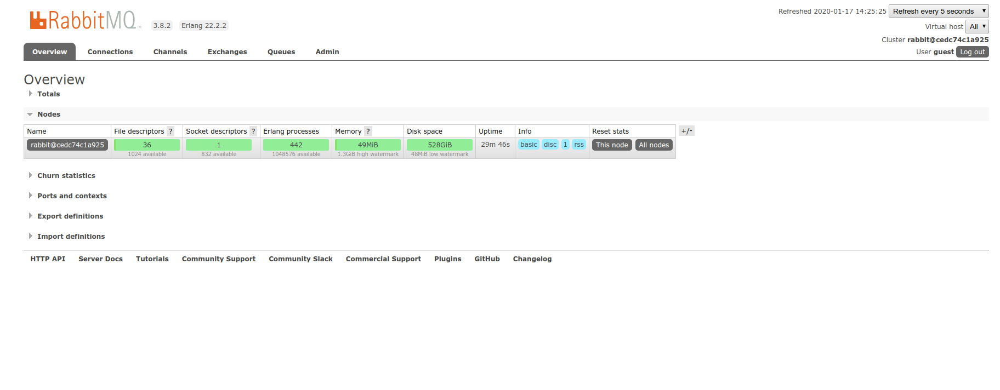
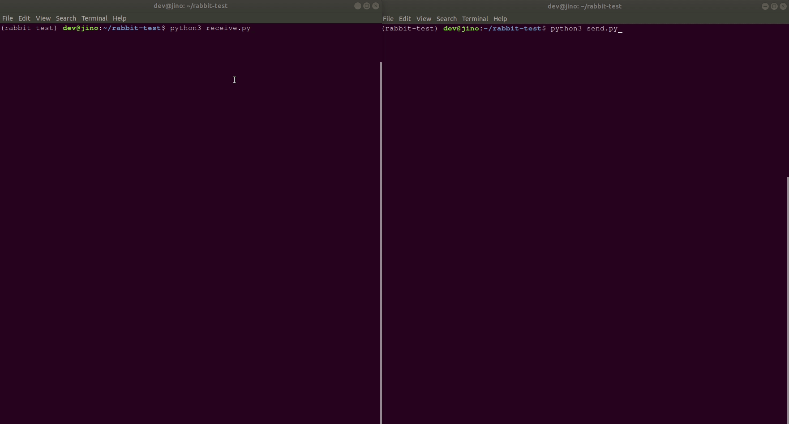

### Setting up RabbitMQ using Docker

[RabbitMQ](https://www.rabbitmq.com/) is an open-source message-broker software that originally implemented the [Advanced Message Queuing Protocol](https://dzone.com/articles/what-is-the-advanced-message-queuing-protocol-amqp) and has since been extended with a plug-in architecture to support Streaming Text Oriented Messaging Protocol, Message Queuing Telemetry Transport, and other protocols.


1.) Create a `docker-compose.yml` and add these contents.

```
version: "3"
services:
 rabbitmq:
    image: "rabbitmq:3-management"
    ports:
      - "5672:5672"
      - "15672:15672"
    volumes:
      - 'rabbitmq_data:/data'

volumes:
  rabbitmq_data:
```

2. Next is to download `rabbitmq` using `docker-compose`.


```
dev@jino:~$ docker-compose up rabbitmq
Creating network "dev_default" with the default driver
Creating volume "dev_rabbitmq_data" with default driver
Pulling rabbitmq (rabbitmq:3-management)...
3-management: Pulling from library/rabbitmq
5c939e3a4d10: Pull complete
c63719cdbe7a: Pull complete
19a861ea6baf: Pull complete
651c9d2d6c4f: Pull complete
da31881b2e3b: Pull complete
3191e1e3d655: Pull complete
ecf3df7a5728: Pull complete
a0630d4301f2: Pull complete
0ce2838b8e32: Pull complete
ceec45df4705: Pull complete
c17b4173288e: Pull complete
23ad587c6331: Pull complete
Creating dev_rabbitmq_1 ... 
Pulling rabbitmq (rabbitmq:3-management)...
Creating dev_rabbitmq_1 ... done
```

3.) You should able to navigate `http://127.0.0.1:15672/` with username `guest` and password `guest`.


**Login Form**


**The main dashboard**




4.) Create project folder `rabbit-test`.

```
dev@jino:~$ mkdir rabbit-test && cd rabbit-test
```


5.) Install [pika](https://pika.readthedocs.io/en/stable/).

```
dev@jino:~/rabbit-test$ pipenv install pika
Installing pika…
Adding pika to Pipfile's [packages]…
✔ Installation Succeeded 
Pipfile.lock (91f2da) out of date, updating to (de044e)…
Locking [dev-packages] dependencies…
Locking [packages] dependencies…
✔ Success! 
Updated Pipfile.lock (91f2da)!
Installing dependencies from Pipfile.lock (91f2da)…
  🐍   ▉▉▉▉▉▉▉▉▉▉▉▉▉▉▉▉▉▉▉▉▉▉▉▉▉▉▉▉▉▉▉▉ 8/8 — 00
```


6.) Activate our shell environment.


```
dev@jino:~/rabbit-test$ pipenv shell
Launching subshell in virtual environment…
 . /home/dev/.local/share/virtualenvs/rabbit-test-WyK9Otlb/bin/activate
dev@jino:~/rabbit-test$  . /home/dev/.local/share/virtualenvs/rabbit-test-WyK9Otlb/bin/activate
(rabbit-test) dev@jino:~/rabbit-test$ 
```


7. Inside your `rabbit-test` folder create these two files.


**[send.py](https://github.com/rabbitmq/rabbitmq-tutorials/blob/master/python/send.py)**

```
#!/usr/bin/env python
import pika

connection = pika.BlockingConnection(
    pika.ConnectionParameters(host='localhost'))
channel = connection.channel()

channel.queue_declare(queue='hello')

channel.basic_publish(exchange='', routing_key='hello', body='Hello World!')
print(" [x] Sent 'Hello World!'")
connection.close()
```

**[receive.py](https://github.com/rabbitmq/rabbitmq-tutorials/blob/master/python/receive.py)**

```
#!/usr/bin/env python
import pika

connection = pika.BlockingConnection(
    pika.ConnectionParameters(host='localhost'))
channel = connection.channel()

channel.queue_declare(queue='hello')


def callback(ch, method, properties, body):
    print(" [x] Received %r" % body)


channel.basic_consume(
    queue='hello', on_message_callback=callback, auto_ack=True)

print(' [*] Waiting for messages. To exit press CTRL+C')
channel.start_consuming()
```

8. Open two(2) terminals and check if its working.

**Terminal 1**

```
(rabbit-test) dev@jino:~/rabbit-test$ python3 send.py
 [x] Sent 'Hello World!'
```

**Terminal 2**

```
(rabbit-test) dev@jino:~/rabbit-test$ python3 receive.py
 [*] Waiting for messages. To exit press CTRL+C
 [x] Received b'Hello World!'
 [x] Received b'Hello World!'
 [x] Received b'Hello World!'
 [x] Received b'Hello World!'
 [x] Received b'Hello World!'
 [x] Received b'Hello World!'
 [x] Received b'Hello World!'

```


9. Done! as you can see we are able to send and receive messages.




### Tutorial and Resources


[More on tutorials](https://www.rabbitmq.com/tutorials/tutorial-one-python.html)

